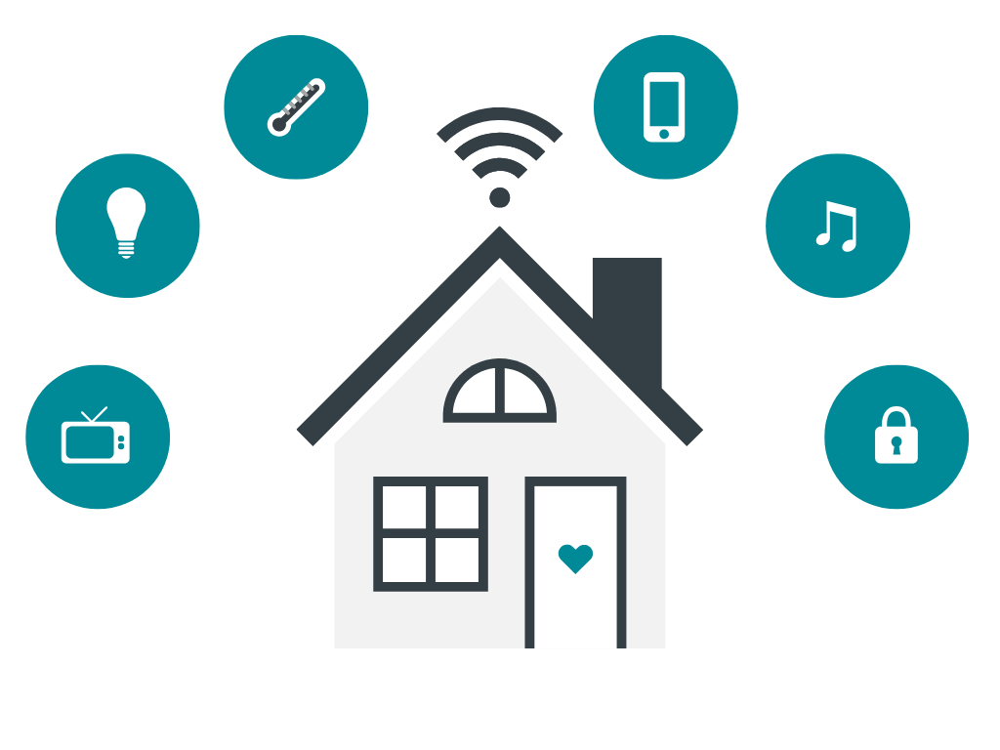
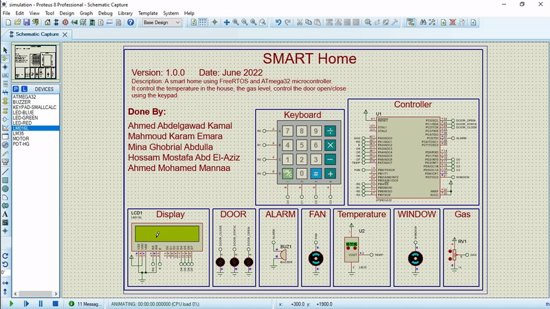
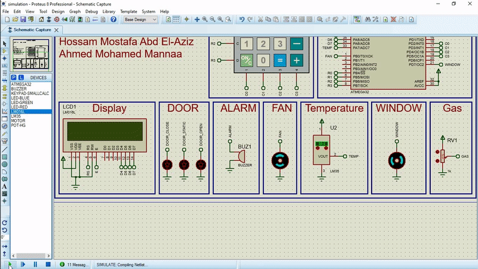
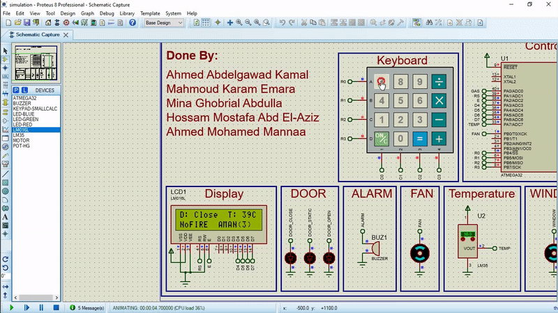

<h1 align="center">Smart Home</h1>

      

<p align="center">
  
</p>

✅ Perform a review and leave a comment <a href="https://github.com/makaram99/smart-home/issues/1">here</a></strong>

✅ If you want to contribute, add a new record like <a href="contributing.md">here</a>. This example is for my [Tank Level Control](https://github.com/makaram99/tank-level-control) project, but the idea is the same for any project.

✅ If this needs to be improved, create an issue <a href="https://github.com/makaram99/smart-home/issues">here</a></strong>

---

The Project was done as a project for RTOS course at [NTI](https://www.nti.sci.eg/).

**Done by:**

1. Mahmoud Karam Emara (ma.karam272@gmail.com)
2. Ahmed Abdelgawad Kamal (ahmedabdelgawad234@gmail.com)
3. Mina Ghobrial Abdulla (menaghobrial98@gmail.com)
4. Hossam Mostafa Abd El-Aziz (hossam11015@gmail.com)
5. Ahmed Mohamed Mannaa (ahmed.mg.manna3@gmail.com)

**Under the supervision of the great instructor:**
Eng. Eman khiary Mohamed (emankhiry34@gmail.com): Embedded Software Engineer and NTI Instructor.

---

## 🔑 Introduction

This is a simple smart home system, done using **FreeRTOS** and **Atmega32** microcontroller.

*The system consists of the following functions:*

1. Gas Sensor to sense the gas level in the house.
2. Temperature Sensor to sense the temperature in the house.
3. Keypad to enter the password to open the door.
4. Motor to open/close the door when the password is correct.
5. Buzzer to alert the user when the system is in alarm mode:
   1. The password is incorrect for 3 times.
   2. The gas level is above the critical level.
6. LCD to display the system's data (temperature, door status, gas level).

We've worked on the application layer ([code/main.c](code/main.c), [code/main.h](code/main.h), [code/main_cfg.c](code/main_cfg.c), and [code/main_cfg.h](code/main_cfg.h)) using the Components On the Shelf (COTS) approach (microcontroller drivers and the freeRTOS kernel).

The project is **open source** and you can use it for your own projects.

You can test it **without any Hardware**, it can be simulated as will be discussed in the next sections. So, you don't need any hardware to run this project.

## Table of Contents

- [🔑 Introduction](#-introduction)
- [Table of Contents](#table-of-contents)
- [🛠️ Development Tools Required](#️-development-tools-required)
- [Project Hierarchy](#project-hierarchy)
  - [Directories](#directories)
  - [Files](#files)
- [⚙ Working](#-working)
  - [System Behavior](#system-behavior)
  - [Code](#code)
  - [Simulation](#simulation)
- [🎯 Results](#-results)
- [📑 Documentation](#-documentation)
- [🔬 What is next?](#-what-is-next)
- [💁‍♂️ Contribute](#️-contribute)
- [📞 Contact me](#-contact-me)
- [🔓 Licenses](#-licenses)
- [🔏 Credits](#-credits)

---

## 🛠️ Development Tools Required

Read this [guide](https://github.com/makaram99/8051-projects/blob/master/tools.md) to know what tools are required to develop this project.

---

## Project Hierarchy

The project contains some files and directories:

### Directories

* **[code](code/)**: Contains the code implemented using VS Code and eclipse SDK.
* **[docs](docs/)**: Contains the documentation files generated by doxygen and make, simulation test pictures, and some assets for README files.
* **[simulation](simulation/)**: Contains the simulation files of Proteus8.11.

### Files

* **[README.md](README.md)**: The description of the project (What you are reading now).
* **[LICENSE](LICENSE)**: The license description of the project.
* **[Doxyfile](Doxyfile)**: The configuration of doxygen application (Documentation generator).
* **[doxygen.mk](doxygen.mk)**: Contains the configuration and rules to be run using make to generate documents.
* **[tools.md](tools.md)**: Contains HOW-TO-SETUP the tools required to run this project.
* **[version_log.md](version_log.md)**: Contains the history of the project.

---

## ⚙ Working

### System Behavior

The System has 5 tasks. These are:

1. Getting Password: This is done using the task (```taskGetPassword(void *pv )```).
   The password is entered by the user using the keypad. The user has 3 attempts to enter the password. If the password is incorrect, the system will be in alarm mode.
   If the password is correct, the system will be in normal mode and the door will be opened.
2. Reading Sensors (Gas & Temperature): This is done using the task (```taskReadSensors(void *pv )```).
   It reads the gas level and temperature from the sensors. The gas level is measured by a potentiometer and the temperature is measured by the temperature sensor LM35.
   This task runs in Non-Blocking mode, which means that it will not block the main task. This is because it uses the ADC in the Non-Blocking mode (```ADC_SetNotification(void)```).
   The ```ADC_SetNotification(void)``` is called by the ADC ISR, and it only gives the semaphore to the taskReadSensors() to read the ADC registers.

   ```taskReadSensors(void *pv )```: will wait for the semaphore to be given by the ADC ISR.

   This task reads one sensor at a time, and when it reads the sensor, it will update the value of the specific sensor, then swap to the next sensor, and repeat this process.
3. Control Gas Level: This is done using the task (```taskControlGasLevel(void *pv )```).
   This task is responsible for controlling the gas level. It checks if the gas level is above the threshold and if it is:

   * Above: Open the window, and raise the flag to alert the user (buzzer).
   * Below: Close the window, and downs the flag of the alert.

   The gas level is read from the ADC using a potentiometer. It is converted to a percentage of the full scale.
4. Control Temperature: This is done using the task (```taskControlTemperature(void *pv )```).
   This task is responsible for controlling the temperature. It checks if the temperature is above the threshold and if it is:

   * Above: Open the fan.
   * Below: Stop the fan.

    Temperature is measured using the LM35 sensor. The LM35 sensor is connected to the ADC. The sensor gives 10mV for every degree Celsius. So, you can measure the temperature in degrees Celsius by dividing the ADC voltage value by 10mV.
5. Display System State On the LCD: This is done using the task (```taskDisplaySystemState(void *pv )```).
   This task is responsible for displaying the system's data. It displays:

   * The temperature.
   * The door status.
   * The fire alarm status.
   * The door security status.

### Code

**The most insteresting files for us are:**

* [code/main.c](code/main.c): Contains main function, tasks implementations, functions used by either main or tasks.
* [code/main.h](code/main.h): Contains prototypes of tasks and functions used in main.c.
* [code/main_cfg.](code/main_cfg.c): Contains system configurations such as:
  
  * Critical values of gas and temperature sensors, 
  * Fire, password, buzzer, and door flags,
  * etc
  
* [code/main_cfg.h](code/main_cfg.h): Contains typedefs and macros definitions used inside [code/main_cfg.c](code/main_cfg.c) and [code/main.c](code/main.c)

**To develop the project, you need to:**

* YOU MUST HAVE **eclipse SDK** installed on your computer.
* Open the **code** directory.
* Click twice on **[.cproject](code/.cproject)** file.
* It will open with eclipse SDK.
* Enjoy the development.
* You can build the project by clicking on **CTRL+B** key on keyboard.

**NOTE**: The code is documented as much as possible. Hope you will understand the code.

### Simulation

To simulate the project, you need to:

* YOU MUST HAVE **Proteus8.11** installed on your computer.
* Open the [simulation](simulation/) directory.
* Click twice on [simulation.pdsprj](simulation/simulation.pdsprj) file.
* It will open with Proteus8.11.
* The simulation works as the following:
* Enjoy the simulation.
* To stop the simulation: Press twice on **ESC** key from the keyboard.


---

## 🎯 Results

NOTE: Click on the images below to start the animation.

1. Testing Temperature:
  
    
  
2. Testing Gas:

    

3. Testing Correct Password:

    

4. Testing Wrong Password:

    

---

## 📑 Documentation

The project is documented using the great **doxygen** application. There are 2 ways to see the documentation, inside the **docs** directory either:

1. Open the [docs/html/index.html](docs/html/index.html) file.
2. Open the [docs/code_documentation.pdf](docs/code_documentation.pdf) file.

**To generate documentation:**

1. YOU MUST HAVE **DOXYGEN** AND **MAKE** INSTALLED ON YOUR COMPUTER.
2. From the home directory of the project ([smart-home](./)), open the command prompt in your OS (**cmd** for Windows, **bash** for linux, ...)
3. Run the following command:
   ```make -f doxygen.mk all```
4. The documentation will be generated in the **[docs](docs)** directory.

**NOTE**: the file doxygen.mk is configured to run on Windows OS. If you want to run it on Linux OS, you need to change the configurations by opening the file and search for the section:

   ```ENVIRONMENT VARIABLES```

   and change each variable value depending on the OS you are using.
   Options are given in the comment before each variable.
   For example, to change the Shell name:

   ``` makefile
   # Shell of the OS, Options are: bash for Linux, sh for MacOS, cmd for Windows
    SHELL = cmd
   ```

Options for shell are:

* **bash** for Linux
* **sh** for MacOS
* **cmd** for Windows

---

## 🔬 What is next?

This project will be always improved this project.
So, if you have any suggestion, create an issue <a href="https://github.com/makaram99/smart-home/issues">here</a></strong> and I will appreciate it.

---

## 💁‍♂️ Contribute

If you want to contribute to the project, you can:

1. Fork the project on your GitHub account.
2. Develop the project on your own.
3. Send a pull request to the project on GitHub.
4. I will review your pull request and add it to the project.

---

## 📞 Contact me

<p><a href="https://www.linkedin.com/in/makaram99" target="_blank"></a> <a href="mailto:ma.karam272@gmail.com" target="_blank"></a> </p>

## 🔓 Licenses

<a rel="license" href="http://creativecommons.org/licenses/by-sa/4.0/"></a><br />All DOCUMENTS inside this work is licensed under a <a rel="license" href="http://creativecommons.org/licenses/by-sa/4.0/">Creative Commons Attribution-ShareAlike 4.0 International License</a>.

All SOURCE codes & BINARIES are licensed under Mit License.

<p align="center">
  

</p>

<p align="center">
  

</p>

---

## 🔏 Credits

All credits and external sources are listed inside the page and inside this repo, references themselves.
