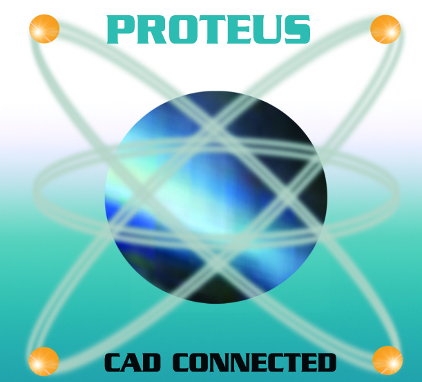

# 🛠️ Development Tools Required

Here, we are talking about development tools required to build and run the projects in this repository (8051 microcontroller projects).

**The tools are**:

* **Toolchain**: <u>eclipse sdk</u> 

  eclipse sdk is used for code development and compiling the system. It is free and open source.
  
  Download: [https://www.eclipse.org/eclipse/](https://www.eclipse.org/eclipse/)
* **Text Editor**: <u>Visual Studio Code</u> 
  
  VS Code is used for code development the system. It is **free**.
  
  Download: [https://code.visualstudio.com/](https://code.visualstudio.com/)
* **Hardware Simulator**: <u>Proteus8.11</u> 
  
  Proteus8.11 is used to simulate the hardware. So, no need to purchase any hardware.
  
  Website: [https://www.labcenter.com//](https://www.labcenter.com//)
* **Documents Generator**: <u>doxygen</u> 
  
  Doxygen is used to generate documentations of the code in html, latex, pdf, and other formats.
  
  Download: [https://www.doxygen.nl/download.html](https://www.doxygen.nl/download.html)
* **Command Line Automation Tool**: <u>make</u> 
  
  Make is used to automate kernel commands.
  I've used it to automate the generation of documents from doxygen.
  
  Download:
  * Linux or MacOS: [https://www.gnu.org/software/make/](https://www.gnu.org/software/make/)
  * Windows: [http://gnuwin32.sourceforge.net/packages/make.htm](http://gnuwin32.sourceforge.net/packages/make.htm)